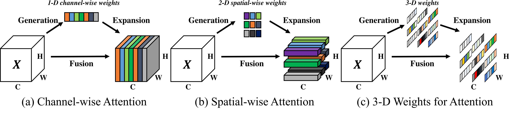
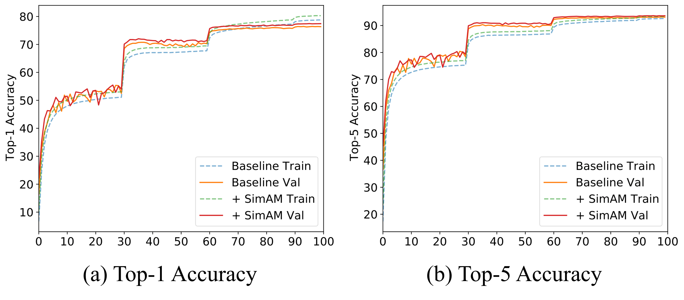

## SimAM: A Simple, Parameter-Free Attention Module for Convolutional Neural Networks
[**Lingxiao Yang**](https://zjjconan.github.io/), [Ru-Yuan Zhang](https://ruyuanzhang.github.io/), [Lida Li](https://github.com/lld533), [Xiaohua Xie](http://cse.sysu.edu.cn/content/2478)

Abstract
----------
In this paper, we propose a conceptually simple but very effective attention module for Convolutional Neural Networks (ConvNets). In contrast to existing channel-wise and spatial-wise attention modules, our module instead infers 3-D attention weights for the feature map in a layer without adding parameters to the original networks. Specifically, we base on some well-known neuroscience theories and propose to optimize an energy function to find the importance of each neuron. We further derive a fast closed-form solution for the energy function, and show that the solution can be implemented in less than ten lines of code. Another advantage of the module is that most of the operators are selected based on the solution to the defined energy function, avoiding too many efforts for structure tuning. Quantitative evaluations on various visual tasks demonstrate that the proposed module is flexible and effective to improve the representation ability of many ConvNets. Our code is available at [Pytorch-SimAM](https://github.com/ZjjConan/SimAM).

--------------------------------------------------

Our environments and toolkits
-----------

- OS: Ubuntu 18.04.5
- CUDA: 11.0
- Python: 3.8.3
- Toolkit: PyTorch 1.8.0
- GPU: Quadro RTX 8000 (4x)
- [thop](https://github.com/Lyken17/pytorch-OpCounter)


Module
------

Our goal is to infer a 3-D attention weights (Figure (c)) with a given feature map, which is very different to previous works as shown in Figure (a) and (b).

<p align="center">

</p>

**SimAM (A pytorch-like implementation).** Detail of implementations, including the module and the network, can be found in ``networks`` in this repository. 


```python
    class SimAM(nn.Module):
        # X: input feature [N, C, H, W]
        # lambda: coefficient λ in Eqn (5)
        def forward (X, lambda):
            # spatial size
            n = X.shape[2] * X.shape[3] - 1
            # square of (t - u)
            d = (X - X.mean(dim=[2,3])).pow(2)
            # d.sum() / n is channel variance
            v = d.sum(dim=[2,3]) / n
            # E_inv groups all importance of X
            E_inv = d / (4 * (v + lambda)) + 0.5
            # return attended features
            return X * sigmoid(E_inv)
```

Training and Validation Curves
----------

<p align="center">

</p>

Experiments
----------

### Training and Evaluation

The following commands train models on ImageNet from scratch with 4 gpus. 


```
# Training from scratch

python main_imagenet.py {the path of ImageNet} --gpu 0,1,2,3 --epochs 100 -j 20 -a resnet18 

python main_imagenet.py {the path of ImageNet} --gpu 0,1,2,3 --epochs 100 -j 20 -a resnet18 
--attention_type simam --attention_param 0.1

python main_imagenet.py {the path of ImageNet} --gpu 0,1,2,3 --epochs 150 -j 20 -a mobilenet_v2
--attention_type simam --attention_param 0.1 --lr .05 --cos_lr --wd 4e-5 
```

```
# Evaluating the trained model

python main_imagenet.py {the path of ImageNet} --gpu 0,1,2,3 -j 20 -a resnet18 -e
--resume {the path of pretrained .pth}
```

### ImageNet


All the following models can be download from **[BaiduYunPan](https://pan.baidu.com/s/1vY-NpeFSHes-dcKdi0xN2g)** (extract code: **teje**) and **[Google Drive](https://drive.google.com/drive/folders/1rRT0UCPeRLPdTCJvv43hvAnGnS49nIWn?usp=sharing).**

|Model                |Parameters |FLOPs    |Top-1(%)   |Top-5(%)|
|:---:                |:----:     |:---:    |:------:   |:------:|
|SimAM-R18            |11.69 M    |1.82 G   |71.31      |89.88   |
|SimAM-R34            |21.80 M    |3.67 G   |74.49      |92.02   |
|SimAM-R50            |25.56 M    |4.11 G   |77.45      |93.66   |
|SimAM-R101           |44.55 M    |7.83 G   |78.65      |94.11   |
|SimAM-RX50 (32x4d)   |25.03 M    |4.26 G   |78.00      |93.93   |
|SimAM-MV2            |3.50 M     |0.31 G   |72.36      |90.74   |

### COCO Evaluation
We use [mmdetection](https://github.com/open-mmlab/mmdetection) to train Faster RCNN and Mask RCNN for object detection and instance segmentation. If you want to run the following models, please firstly install `mmdetection` with their guide. And then put all `.py` in mmdetection of this repository to the corresponding folders. All the following models can be download from **[BaiduYunPan](https://pan.baidu.com/s/1XR2-IvSMvXwWSJO3Xak9Kg)** (extract code: **97g6**) and **[Google Drive](https://drive.google.com/drive/folders/1F8W3MY32crU6jUeV2sgc_4AQwqt_MvAp?usp=sharing).**


#### Detection with Faster RCNN (FR for short) and Mask RCNN (MR for short)

|Model          |AP     |AP_50      |AP_75|AP_S     |AP_M      |AP_L |
|:----:         |:----: |:---:      |:--: |:----:   |:---:     |:--: |
|FR-SimAM-R50   |39.2   |60.7       |40.8 |22.8     |43.0      |50.6 |
|FR-SimAM-R101  |41.2   |62.4       |45.0 |24.0     |45.6      |52.8 |
|MR-SimAM-R50   |39.8   |61.0       |43.4 |23.1     |43.7      |51.4 |
|MR-SimAM-R101  |41.8   |62.8       |46.0 |24.8     |46.2      |53.9 |


#### Instance Segmentation with Mask RCNN (MR for short)

|Model          |AP     |AP_50      |AP_75|AP_S     |AP_M      |AP_L |
|:----:         |:----: |:---:      |:--: |:----:   |:---:     |:--: |
|MR-SimAM-R50   |36.0   |57.9       |38.2 |19.1     |39.7      |48.6 |
|MR-SimAM-R101  |37.6   |59.5       |40.1 |20.5     |41.5      |50.8 |

--------------------------------------------------------------------


Citation
--------
If you find SimAM useful in your research, please consider citing:

    @InProceedings{pmlr-v139-yang21o,
        title = 	 {SimAM: A Simple, Parameter-Free Attention Module for Convolutional Neural Networks},
        author =       {Yang, Lingxiao and Zhang, Ru-Yuan and Li, Lida and Xie, Xiaohua},
        booktitle = 	 {Proceedings of the 38th International Conference on Machine Learning},
        pages = 	 {11863--11874},
        year = 	 {2021},
        editor = 	 {Meila, Marina and Zhang, Tong},
        volume = 	 {139},
        series = 	 {Proceedings of Machine Learning Research},
        month = 	 {18--24 Jul},
        publisher =    {PMLR},
        pdf = 	 {http://proceedings.mlr.press/v139/yang21o/yang21o.pdf},
        url = 	 {http://proceedings.mlr.press/v139/yang21o.html}
    }

## Contact Information

If you have any suggestion or question, you can contact us by: lingxiao.yang717@gmail.com. Thanks for your attention!
